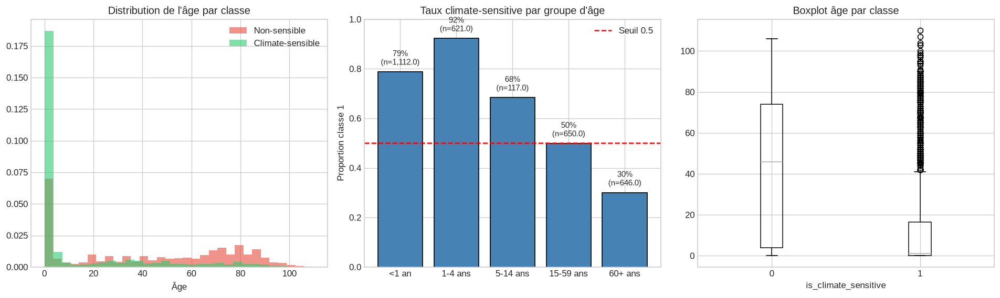
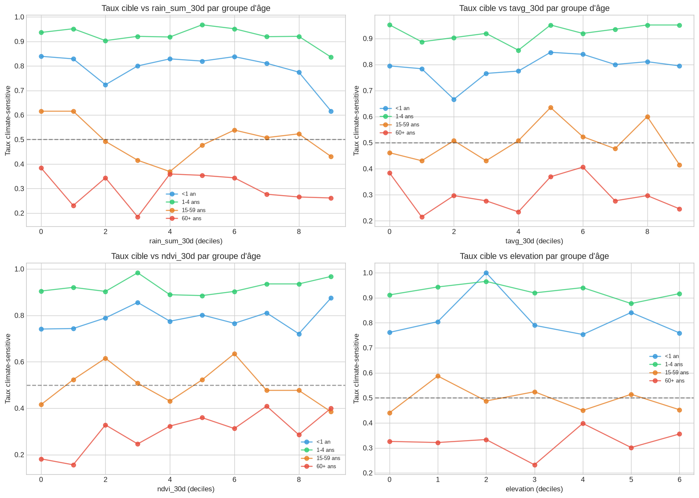
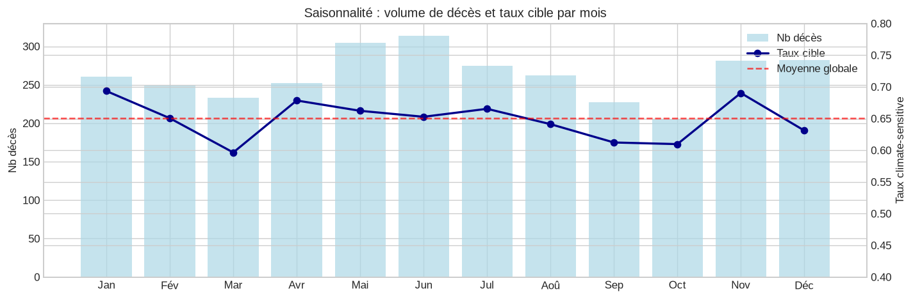
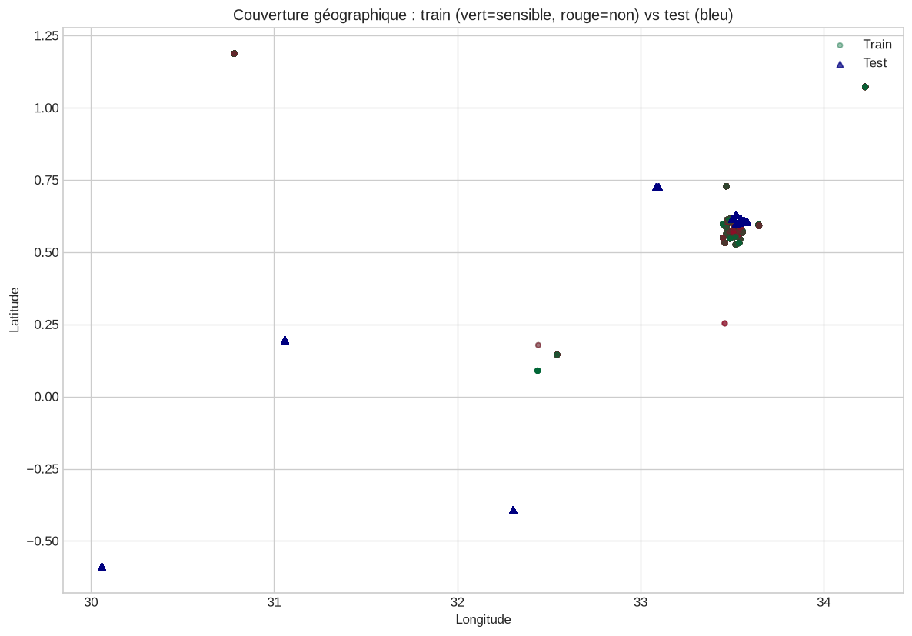
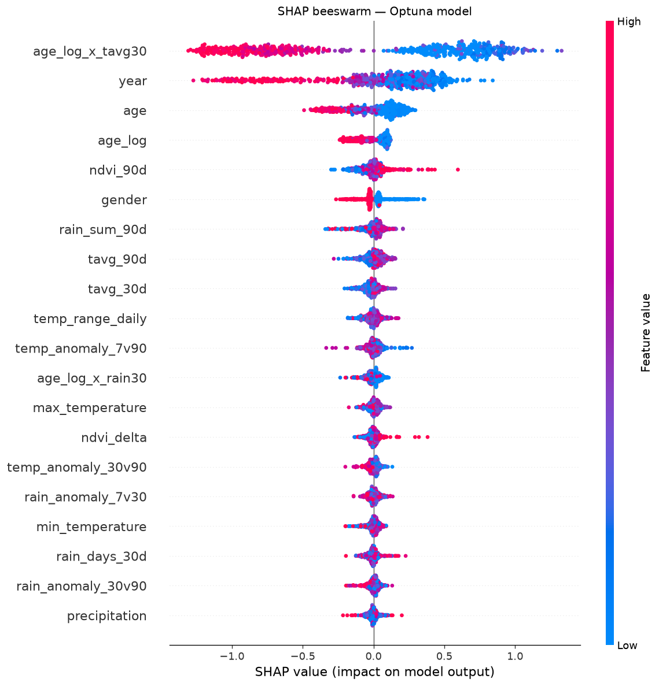
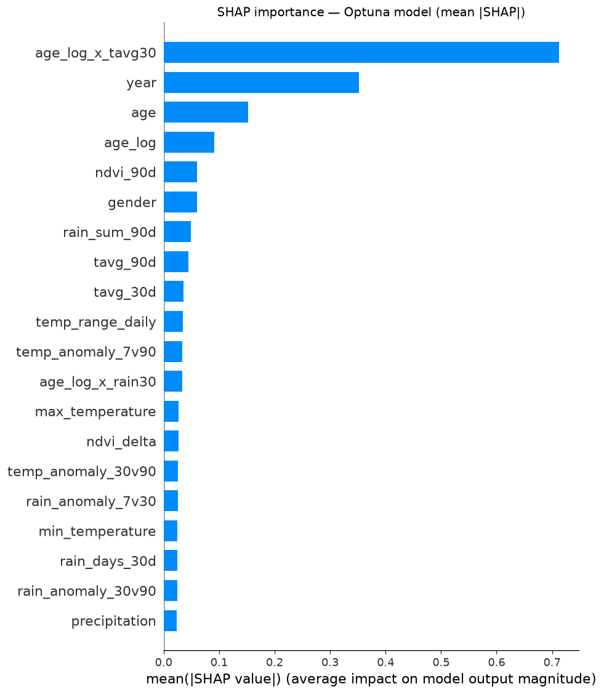
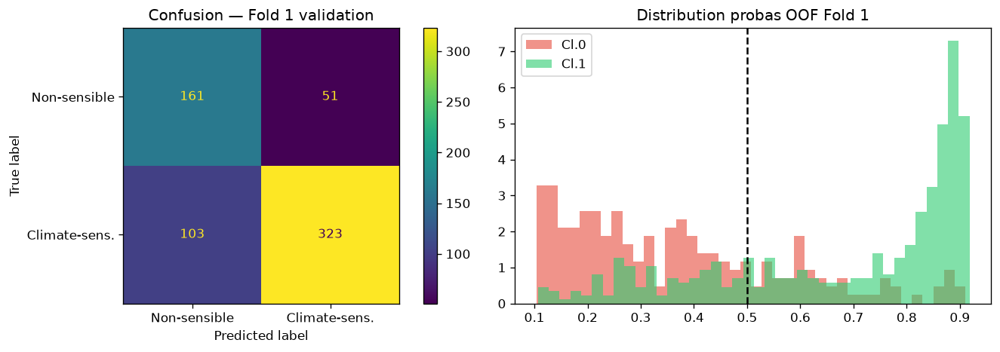
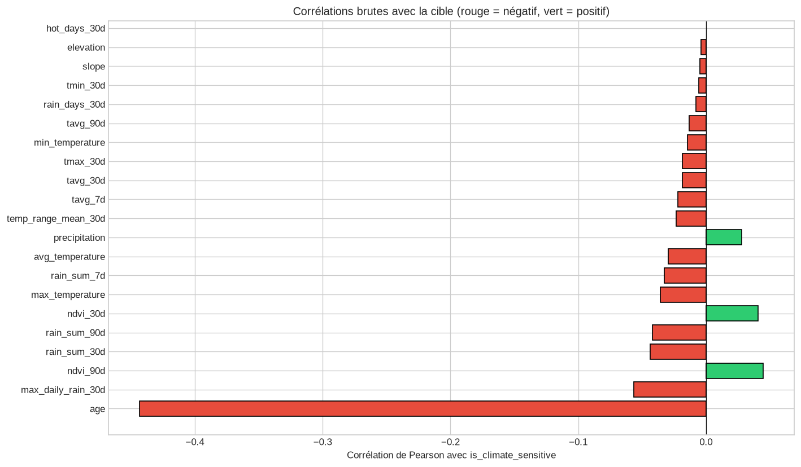

# Climate Risk & Health Prediction — Uganda

> **Can we predict whether a death was caused by climate-sensitive disease, using only weather data and demographics?**
> This is the question at the heart of the [Zindi Climate Risk and Health Prediction Challenge](https://zindi.world/competitions/climate-risk-health-prediction-challenge).

[](https://zindi.world/competitions/climate-risk-health-prediction-challenge)
[](https://zindi.world/competitions/climate-risk-health-prediction-challenge/leaderboard)
[](https://www.python.org/)
[](https://catboost.ai/)
[](LICENSE)

---

## The Business Problem

In Uganda and across sub-Saharan Africa, millions of deaths each year are directly linked to climate conditions — malaria spreading after heavy rains, diarrheal disease following floods, respiratory illness in cold seasons. **But health systems often can't tell which deaths are climate-driven**, making it impossible to deploy interventions proactively.

This project builds a machine learning model trained on **death registry data from the Iganga-Mayuge Health and Demographic Surveillance System (HDSS)** in eastern Uganda (2007–2022). Given a person's age, sex, location, and the climate conditions in the weeks before their death, the model predicts whether that death was **climate-sensitive**.

**Stakeholder value:** A deployed version of this model could serve as an early warning signal — if a district shows a sudden rise in predicted climate-sensitive deaths during a rainy season, health authorities can pre-position malaria treatments, water purification tablets, and mosquito nets before deaths spike.

---

## Key Findings at a Glance

### 1. Age is the dominant signal

Children under 5 die from climate-sensitive causes at a rate of **92%**. Adults over 60, by contrast, die mostly from chronic diseases — only **30% climate-sensitive**. This single biological fact drives more predictive power than any weather variable alone.

<p align="center">
  
</p>

### 2. Climate matters most *through* age interactions

Raw precipitation has a near-zero linear correlation with the target (r = -0.04). But once we interact it with age — `age_log × rain_sum_30d` — it becomes one of the top features in the model. Climate kills children differently than it kills adults.

<p align="center">
  
</p>

### 3. Uganda's bimodal rainy seasons create predictable mortality windows

Uganda has two rainy seasons (Long Rains: Mar–May, Short Rains: Aug–Nov). Malaria mortality follows with a **4–6 week lag** after each peak — a pattern confirmed in the peer-reviewed literature for this exact site (PMC12676583).

<p align="center">
  
</p>

### 4. The geography challenge — train and test barely overlap

Only **1 location** is shared between the 39 training villages and 11 test villages. The model must generalize to entirely new geographies. This drove the choice of **GroupKFold cross-validation by location** to simulate this generalization challenge honestly.

<p align="center">
  
</p>

### 5. What the model learned (SHAP analysis)

The most impactful features confirm the epidemiological story: cumulative rainfall windows (30d, 90d), NDVI as a proxy for mosquito habitat, temperature variability, and age-climate interactions dominate. Age alone appears at rank 25 — meaningful only when interacted with context.

<p align="center">
  
</p>

<p align="center">
  
</p>

---

## Methodology

```
┌─────────────────┐    ┌─────────────────┐    ┌─────────────────┐
│  1. Literature  │ →  │  2. EDA &       │ →  │  3. Feature     │
│     Review      │    │     Cleaning    │    │     Engineering │
│  (PMC papers,   │    │  (class balance,│    │  (59 features,  │
│   WHO reports)  │    │   geo leakage)  │    │   age×climate)  │
└─────────────────┘    └─────────────────┘    └─────────────────┘
                                                       │
                                                       ▼
                              ┌─────────────────────────────────┐
                              │  4. Modeling & Validation        │
                              │  GroupKFold(5) by location       │
                              │  Optuna 50 trials (CatBoost)    │
                              │  Metric: 0.6×F1 + 0.4×ROC-AUC  │
                              └─────────────────────────────────┘
```

### Step 1 — Literature-Driven Hypotheses

Before touching the data, we reviewed peer-reviewed literature on climate-sensitive mortality at the Iganga-Mayuge HDSS specifically. Key findings that shaped feature design:

- Malaria transmission peaks **2–8 weeks** after heavy rainfall events — justifying 7d, 30d, 90d lag windows
- The critical rainfall threshold in Uganda is **>200 mm/week** for mosquito breeding
- Temperature in this region (20–25°C year-round) is always within the Plasmodium falciparum transmission range — temperature anomalies matter more than absolute values
- Children under 5 account for the vast majority of climate-sensitive deaths

### Step 2 — EDA & Data Cleaning

| Dataset | Rows | Columns | Notes |
|---------|------|---------|-------|
| Train.csv | 3,146 | 13 | Labels included |
| Test.csv | 1,030 | 12 | No labels |
| climate_features.csv | 4,176 | 18 | ERA5 + CHIRPS + MODIS features |

**Class balance:** 65.1% climate-sensitive vs 34.9% not — moderate imbalance handled via `scale_pos_weight` in CatBoost.

**Critical discovery — geographic leakage:** Only 1 of 39 training locations appears in the 11 test locations. The `location` column was excluded entirely to avoid overfitting to training villages.

### Step 3 — Feature Engineering (59 features)

| Category | Features | Example |
|----------|----------|---------|
| **Age** | Buckets, flags, log transform | `is_child_u5`, `age_log`, `age_bucket` |
| **Climate lags** | 7/30/90d windows | `rain_sum_90d`, `tavg_30d`, `ndvi_30d` |
| **Anomalies** | Short vs long window deltas | `temp_anomaly_7v90`, `rain_anomaly_7v30` |
| **Seasonality** | Uganda's 4 seasons, cyclical encoding | `season_uganda`, `month_sin/cos` |
| **Epidemiology** | Literature-based flags | `is_malaria_peak_season`, `is_heavy_rain_week` |
| **Interactions** | Age × climate | `age_log_x_rain30`, `u5_x_ndvi` |
| **External (NASA)** | Humidity, wind, solar radiation | `rh2m_30d`, `heat_index_30d` |

> All features are derived from publicly available sources: ERA5-Land, CHIRPS, MODIS NDVI, SRTM elevation, NASA POWER API.

### Step 4 — Modeling

**Algorithm:** CatBoost (gradient boosting) — selected for robustness on tabular data with mixed feature types.

**Validation:** `GroupKFold(5)` stratified by location — ensures the model is never evaluated on the same geography it trained on, simulating the real-world deployment scenario.

**Hyperparameter optimization:** Optuna (50 trials, TPE sampler). Key finding: `scale_pos_weight = 1.16` (slightly above 1.0) outperforms the naive class frequency ratio — the model performs best when it leans slightly toward predicting positive.

```python
best_params = {
    "learning_rate":     0.01925,
    "depth":             5,
    "l2_leaf_reg":       4.921,
    "subsample":         0.762,
    "colsample_bylevel": 0.986,
    "min_data_in_leaf":  20,
    "scale_pos_weight":  1.160,   # counter-intuitively close to 1.0
}
```

---

## Experiment Log

| Version | Model | CV Score | LB Public | Delta | Key Change |
|---------|-------|----------|-----------|-------|------------|
| v1 | LightGBM baseline | 0.7863 | 0.8113 | — | 59 features, class_weight=balanced |
| v5 | LightGBM Optuna 50 | 0.7982 | — | +0.0119 | scale_pos_weight, clean features |
| v8 | Ensemble (LGBM+XGB+CB) | 0.8016 | — | +0.0034 | Weighted ensemble |
| v12 | Stacking (CB + LGBM → LogReg) | 0.8185 | — | +0.0169 | L2 meta-learner |
| **v17** | **CatBoost Optuna 50 (SPW)** | **0.8240** | **0.8329** | **+0.0055** | **Best model** |
| v19 | NASA POWER features added | 0.8203 | — | -0.0037 | Humidity features hurt (redundant) |

**Gap between CV and LB:** CV=0.8240 → LB=0.8329 (+0.009). GroupKFold creates harder validation splits than the actual test set — the model generalizes better geographically than CV suggests.

---

## Model Performance

<p align="center">
  
</p>

<p align="center">
  
</p>

**Error analysis (OOF):**
- **501 False Positives** — avg age 15, avg predicted probability 0.67. Young people in rainy seasons who died of non-climate causes (e.g. accidents).
- **255 False Negatives** — avg age 64, avg predicted probability 0.36. Elderly climate-sensitive deaths the model misses because it associates age with non-CS mortality.

---

## Repository Structure

```
climate_risk_health/
├── data/
│   ├── Train.csv                         # Raw training data
│   ├── Test.csv                          # Raw test data
│   ├── climate_features.csv              # ERA5 + CHIRPS + MODIS features
│   ├── X_train.parquet                   # Engineered feature matrix (train)
│   ├── X_test.parquet                    # Engineered feature matrix (test)
│   └── nasa_cache/                       # NASA POWER cached JSON (~880 files)
│
├── notes/
│   ├── 01_problem_understanding.md       # Literature review & hypotheses
│   ├── 02_eda.md                         # EDA decisions & data quality
│   ├── 03_feature_engineering.md         # All features with justification
│   ├── 04_modeling.md                    # Experiment log & SHAP insights
│   ├── experiments.csv                   # Machine-readable experiment tracker
│   └── fig_*.png                         # All analysis charts
│
├── optuna_cb_spw.py                      # Best model — CatBoost Optuna with SPW
├── build_nasa_features.py                # NASA POWER feature pipeline
├── download_nasa.py                      # NASA POWER API downloader
├── stacking_v15.py                       # Stacking ensemble
└── README.md
```

---

## How to Reproduce

```bash
# 1. Clone and install
git clone <this-repo>
cd climate_risk_health
python -m venv .venv && source .venv/bin/activate
pip install catboost lightgbm optuna scikit-learn pandas numpy pyarrow

# 2. Run the best model (CatBoost + Optuna, ~25 min on CPU)
python optuna_cb_spw.py

# 3. (Optional) Download NASA POWER external data
python download_nasa.py       # Downloads ~880 JSON files (may take 30 min)
python build_nasa_features.py  # Builds and evaluates humidity features
```

**Reproducibility:** All random seeds are fixed at `SEED=42`. GroupKFold splits are deterministic given the `location` group column.

---

## Data Sources

| Source | Variables | Access |
|--------|-----------|--------|
| [ERA5-Land (Copernicus)](https://cds.climate.copernicus.eu/) | Temperature, precipitation | Free, API key required |
| [CHIRPS](https://www.chc.ucsb.edu/data/chirps) | Precipitation at 0.05° | Fully public |
| [MODIS MOD13Q1](https://lpdaac.usgs.gov/products/mod13q1v006/) | NDVI (vegetation index) | Fully public |
| [SRTM (NASA)](https://www2.jpl.nasa.gov/srtm/) | Elevation, slope | Fully public |
| [NASA POWER API](https://power.larc.nasa.gov/) | Humidity, wind, solar radiation | Fully public, no auth |
| Zindi (provided) | climate_features.csv | Competition only |

---

## Key Takeaways for Public Health Stakeholders

1. **Children under 5 are the clearest signal.** 9 out of 10 deaths in this group are climate-sensitive. Surveillance systems should weight under-5 mortality as a primary climate indicator.

2. **Rainfall 4–6 weeks ago predicts today's climate deaths better than current conditions.** The malaria transmission lag is real and measurable in the data.

3. **Geography matters enormously.** The same rainfall event has very different effects depending on elevation, vegetation density, and proximity to water bodies. District-level aggregation loses this nuance.

4. **The model gets harder cases wrong predictably.** Young adults (15–30) in rainy seasons and elderly in high-humidity areas are the most ambiguous cases — these populations deserve targeted follow-up in any deployment.

---

## References

- Mwandigha et al. (2026). *Quantifying the Lagged Effects of Climate Variables on Malaria Risk in Eastern Uganda.* [PMC12676583]
- Ssempiira et al. (2026). *Climate-driven malaria mortality among children in malaria-endemic areas of Uganda.* [PMC12360017]
- WHO (2023). *Climate change and health in the African Region.* Regional Office for Africa.

---

*Zindi Challenge · Metric: 0.6×F1 + 0.4×ROC-AUC · Threshold: 0.5 (fixed) · Validation: GroupKFold(5) by location*
